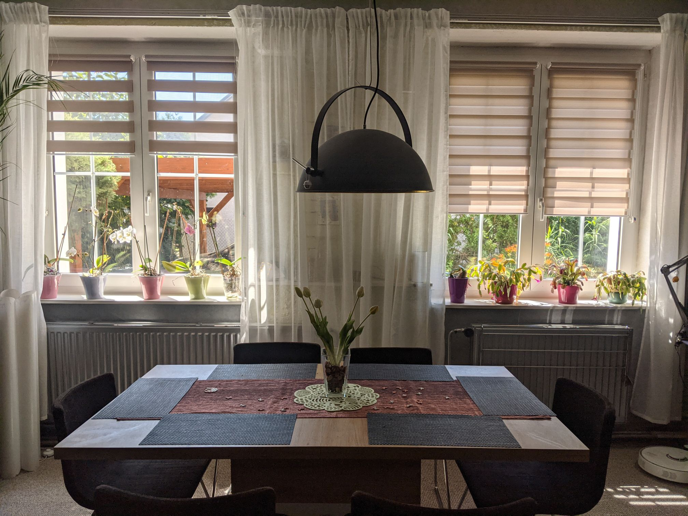

# ver_1.1

## Introduction
ver_1.1 is the software part of the MAT_Blinds project. It was launched in early May 2022 and should be permanently replaced by [ver_2.0](../ver_2.0/README.md) in July 2022. 

- It only supports hardware revision 1.0 ([rev_1.0](../../Schematic/rev_1.0/README.md))
- only Czech language supported
- up to 6 blinds (6 motors)
    - the blinds are retracted / extended one after the other
    - [combined control](../../explanations/combined_control.md) - blind position window_A = blind position window_A_2, same for B and C
- 1.3" display with 3 buttons

- disadvantages
    - Required knowledge of STM32Cube to calibrate the blind.
    - support only Czech

Here is [Setup](Setup.md) 

## Photo

## Video

Click to Watch! ([rev_1.0](./Schematic/rev_1.0/) with [ver_1.1](./Code/ver_1.1/))

