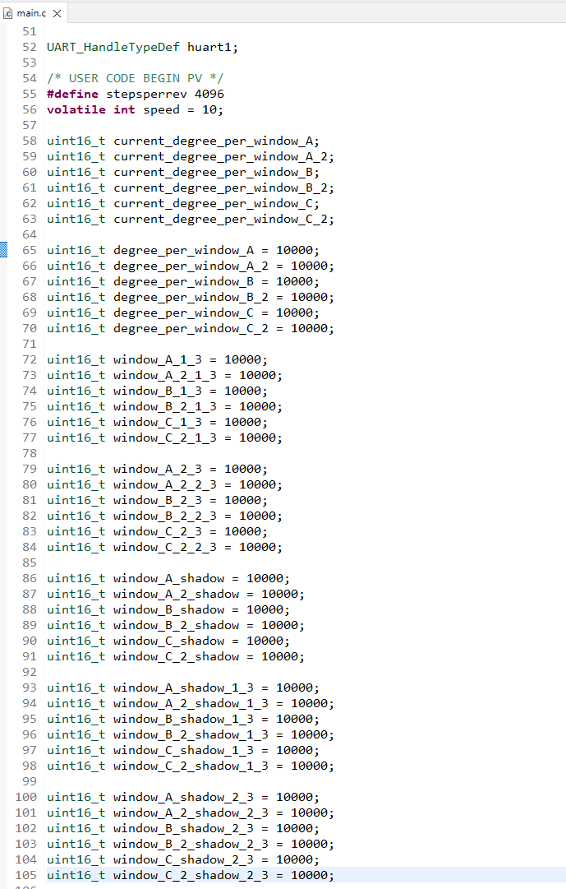
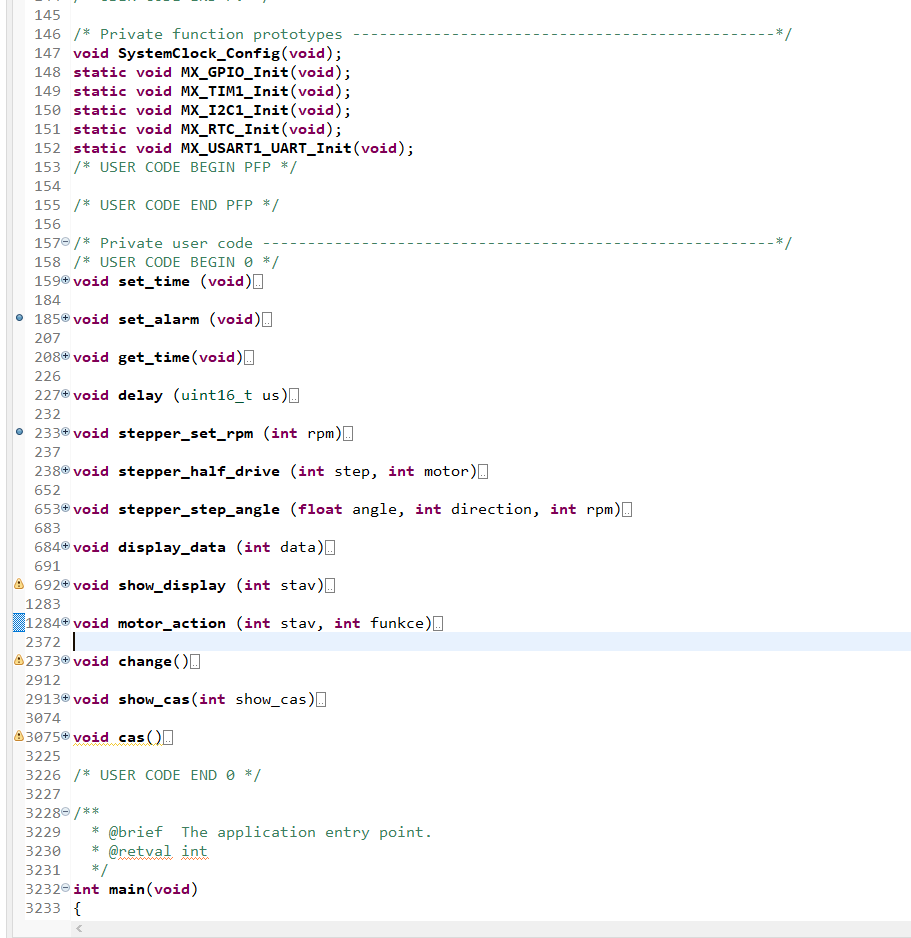

# Setup 

## Introduction
-   After the software is uploaded to the board, it still needs to be set up.

-   With ver_1.1 it is much more complicated. It will be necessary to start the STM32Cube, load the project ([MAT_Blinds_ver_1.1](MAT_Blinds_ver_1.1.zip)) into it and change the blind position values in "main.c". 
    - NOTE - Since this was my first major project in STM32cube and I didn't know how to use .c files, it will be necessary to [minimize the functions](../../Photo/Photo_used_in_documentation/main.c_3.png) in it after opening (Because all the functions are in "main.c".). Sorry for that ❤

- After opening, we find in the section "/* USER CODE BEGIN PV */" the values are set to 10,000. Now we have to pull the blinds up manually.

- Using debug and display, we will calibrate each blind separately. In the settings, we restart each blind. (Settings -> Calibration -> Calibration A) We do this with each blind.

- Now we press Window A -> extended -> extended. The blind should now move down, if it starts to move up, press the confirmation button again, it will immediately stop the blind. ([How to invert the movement of the blind](./invert_the_movement.md))

- If the blind goes down, when it reaches 1/3, we press the confirmation button and in the STM32 cube we find the current value of "window_A_1_3" using debug. We write this value instead of the value: "10,000".

- This is how we do it for all positions and all blinds.

- After that, we need to upload the new modified code to the board.

- Now we just have to set the time in the settings and when we want the blinds to pull up / pull down. 

### Photo

