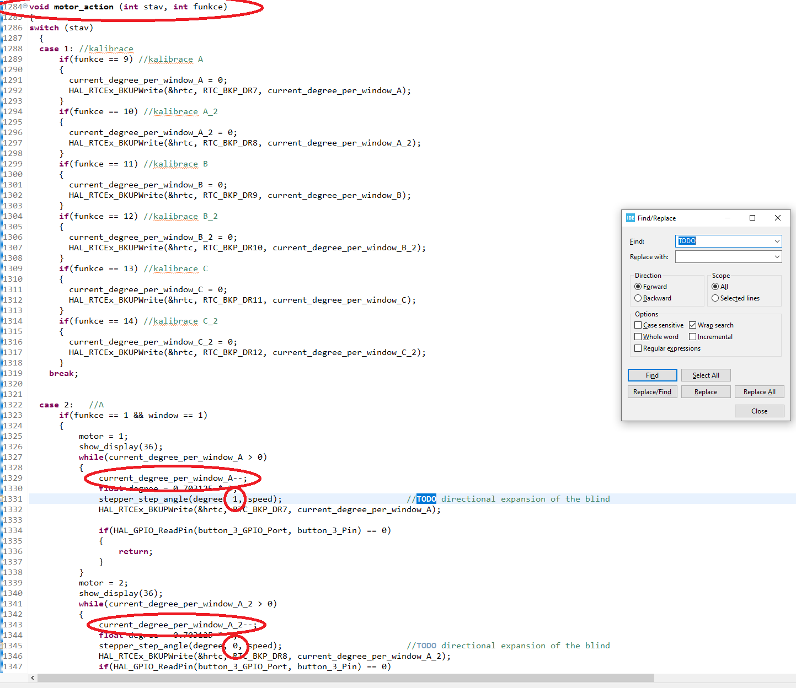

# How to invert the movement of the blind

## Introduction
If we need to invert the movement of the blind. In STM32Cube, in "main.c" using the "ctrl+f" function, we search for "TODO" and in the "motor_action" function, we have to change the value in the cell of the "stepper_step_angle" function, from 1 to 0 or from 0 to 1. It is always written "TODO".

### Photo
