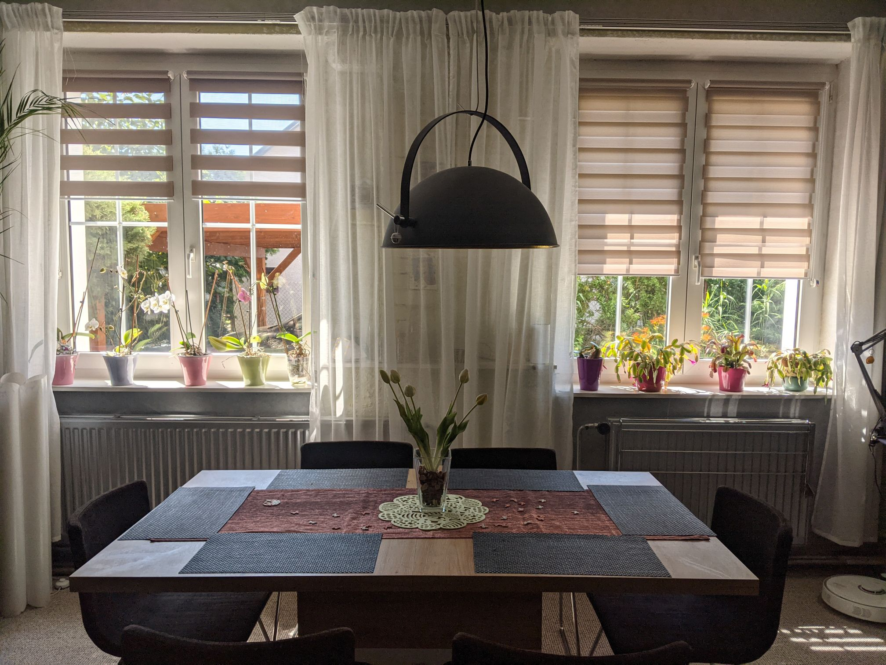

# ver_3.0 

## Introduction
ver_3.0 is the software part of the MAT_Blinds project. It was launched during July 2022 and replaced [ver_1.0](../ver_1.0/README.md).

- Supports hardware versions only 3.0 ([rev_3.0](..//../Schematic/rev_3.0/README.md))
- Supports English and Czech languages.
- easy to build (support [rev_3.0](../Schematic/rev_3.0/README.md))
- up to 4 blinds (4 motors)
    - the blinds are pulling up / pulling down at the same time
    - [separate control](../../explanations/separate_control.md)   
- 1.3" display with Encoder

### Update for version 3.1
- ver_3.1
    - code optimization
    - larger range of blinds
    - greater accuracy of blinds
    - add display shutdown after 30s of non-use

Here is [Setup](Setup.md) 

## Photo

## Video

Click to Watch! ([rev_3.0](./Schematic/rev_3.0/) with [ver_3.0](./Code/ver_3.0/))
