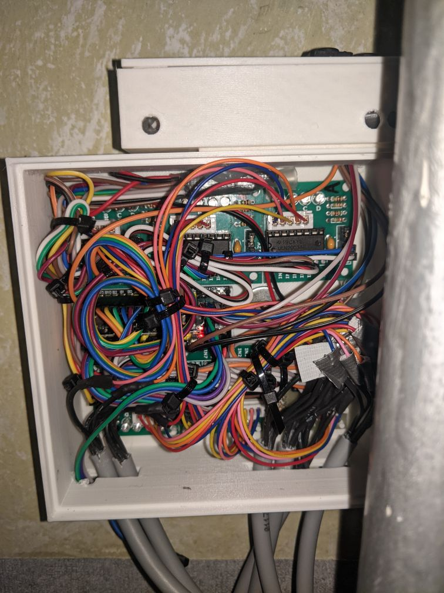
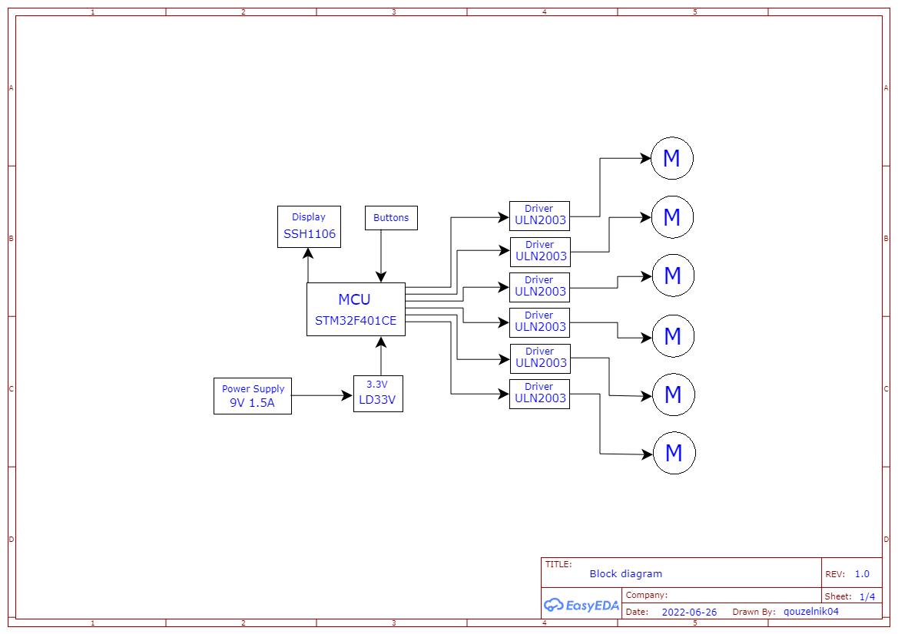

# rev_1.0

## Introduction
rev_1.0 is the hardware part of the MAT_Blinds project. It was launched in early May and was permanently replaced by [rev_3.0](../rev_3.0/README.md) in July 2022. 

- It only supports software versions up to 1.1 ([ver_1.1](../../Code/ver_1.1/README.md)).
- Up to 6 blinds (6 motors)
- 1.3" display with 3 buttons
- Complete [Schematic](./Schematic.pdf)

## Parts
- STM32F401 (MCU, Development Board)
    - [Pinout](../../Photo/Photo_used_in_documentation/rev_1.0_STM32_Pinout.png)
- 6x ULN2003 (Stepper Motor Driver Board)
- SSH1106 (1.3" OLED display)
- LD33V (3.3V LDO Regulator)
- Power supply (9V 1.5A)

## Photo

