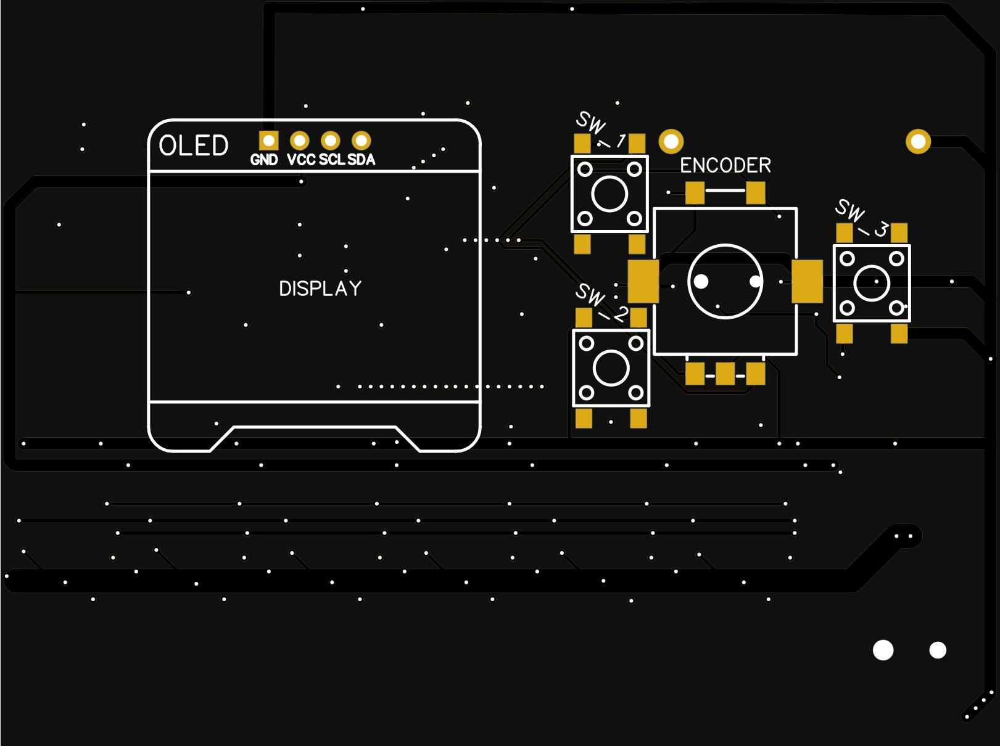

# rev_2.0 coming soon

## Introduction
rev_2.0 is the hardware part of the MAT_Blinds project. It should be launched during 2022.

- Supports software versions only from 2.0 ([ver_2.0](..//../Code/ver_2.0/README.md))
- up to 6 blinds (6 motors)
- 1.3" display with encoder or 3 buttons 
- support up to 4 light sensors
- support WiFi connection

## Parts
- STM32F401 (MCU)
    - [Pinout](../../Photo/Photo_used_in_documentation/rev_2.0_STM32_Pinout.png)
- ESP-12E (MCU)
- 6x A4988 (Stepper Motor Driver)
- SSH1106 (1.3" OLED display)
- AMS1117-3.3 (3.3V LDO Regulator)
- power supply (9V 1.5A)

## Photo

