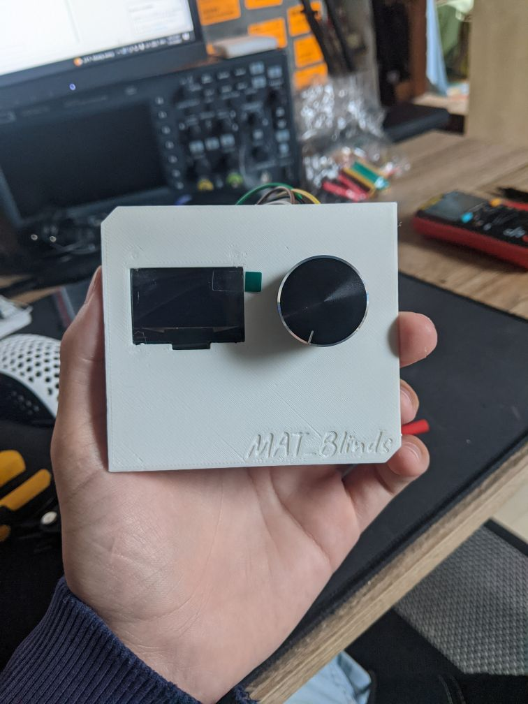
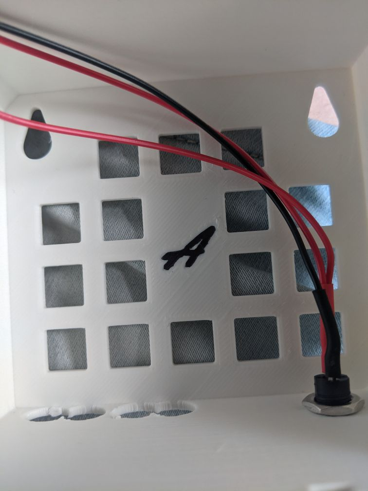
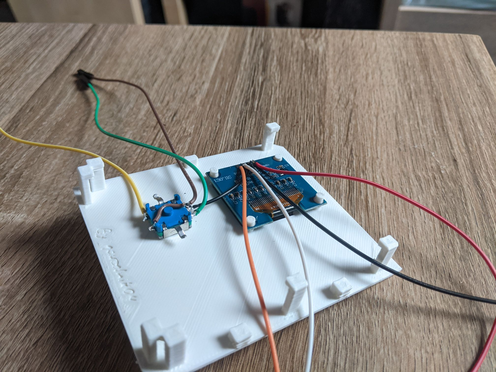
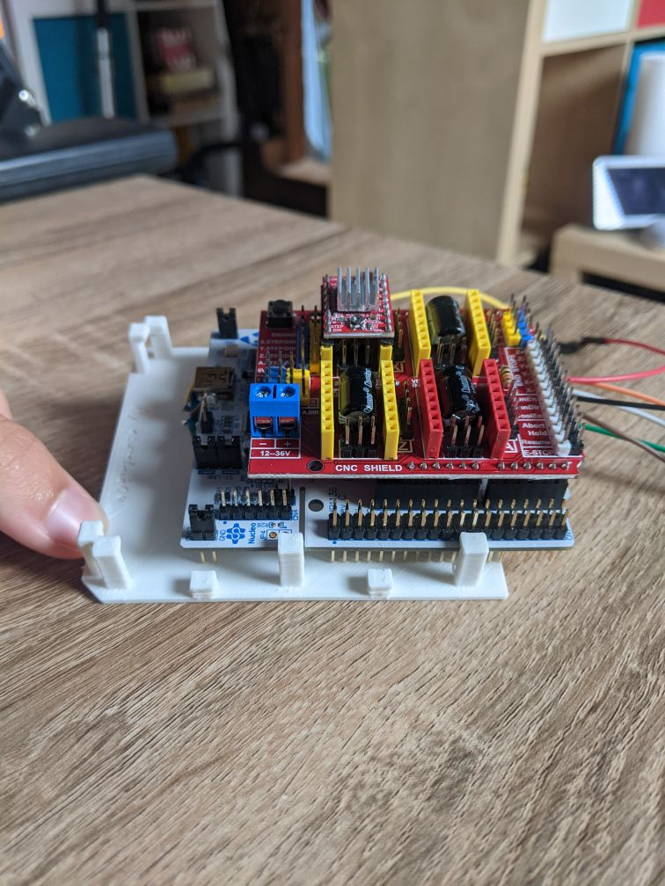
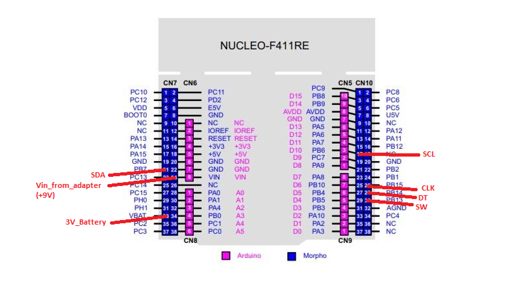
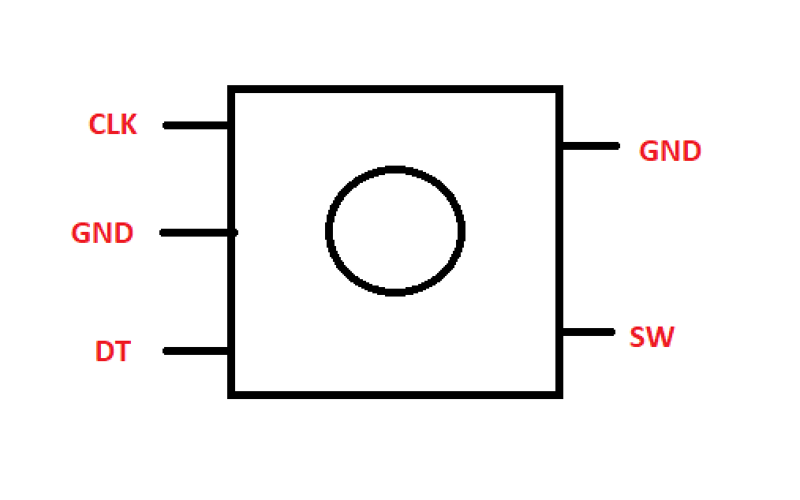
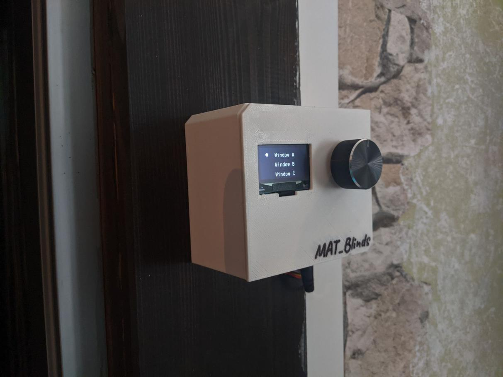

# How_to_make_board

## Introduction
This is a tutorial on how to make a board for rev_3.0.

## Parts
- NUCLEO-F411RE (MCU)
- Arduino CNC shield
- 4x A4988 (Stepper Motor Driver)
- SSH1106 (1.3" OLED display)
- Power supply (9V 1A)
    - connector for power supply
- [Case](../../parts/3D_parts/Case_rev_3.0.obj) Big a shout-out to [my brother](https://www.instagram.com/matalan09/?theme=dark) for designing these proposals.

## Steps
- Step 1
    - We have to remove the resistor (SB45) from the nucelo board, and move jumper (C20) to connect right and midle pin.
- Step 2
    - We will print the case. We will then install the display and encoder into it. As in the [photo](../../Photo/Photo_used_in_documentation/Photo_7.jpg). We will also install the conector on the adapter. As in the [photo](../../Photo/Photo_used_in_documentation/Photo_4.jpg). We then solder the cables to the display and the encoder. As in the [photo](../../Photo/Photo_used_in_documentation/Photo_6.jpg).
- Step 3
    - Now we will put the arduino CNC shield on the nucleo board. We will install 4 drivers into the CNC shield. As in the [photo](../../Photo/Photo_used_in_documentation/Photo_5.jpg).
- Step 4
    - We connect the display, encoder, 3V battery and power supply to the nucleo board. As in the [photo](../../Photo/Photo_used_in_documentation/Photo_8.png).
- Step 5
    - Now we will install the case on the wall and then connect the engines. As in the [photo](../../Photo/Photo_used_in_documentation/Connect_motor_CNC.png).

## Photo

