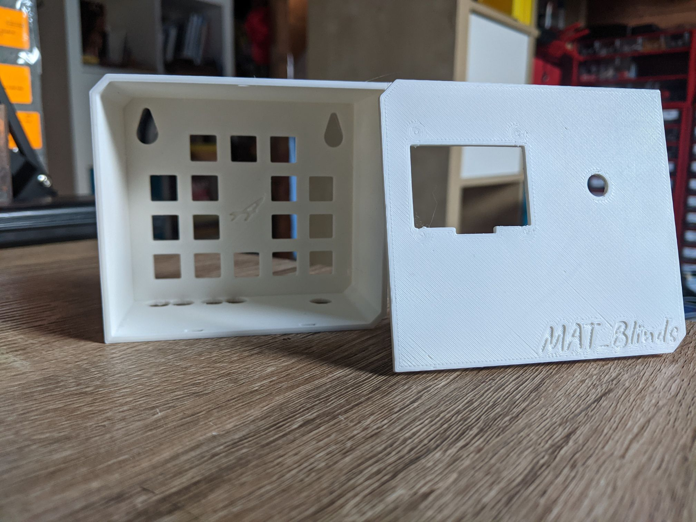

# rev_3.0 

## Introduction
rev_3.0 is the hardware part of the MAT_Blinds project. It was launched during July 2022 and replaced [rev_1.0](../rev_1.0/README.md).

- Easy to build
- Supports software versions only from 3.0 ([ver_3.0](../../Code/ver_3.0/README.md))
- Up to 4 blinds (4 motors)
- 1.3" display with encoder 

## Parts
- NUCLEO-F411RE (MCU)
- Arduino CNC shield
- 4x A4988 (Stepper Motor Driver)
- SSH1106 (1.3" OLED display)
- Encoder
- Power supply (9V 1A)
- [Case](../../parts/3D_parts/Case_rev_3.0.obj) Big a shout-out to [my brother](https://www.instagram.com/matalan09/?theme=dark) for designing these proposals.

- [How to make rev_3.0 board](./How_to_make_board.md)

## Photo

