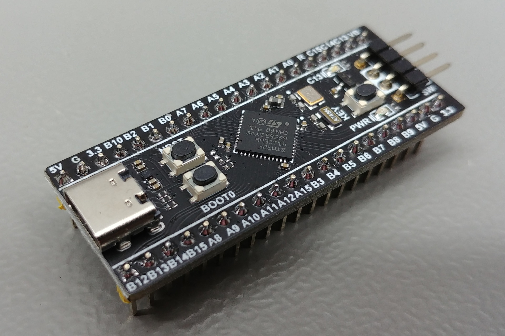
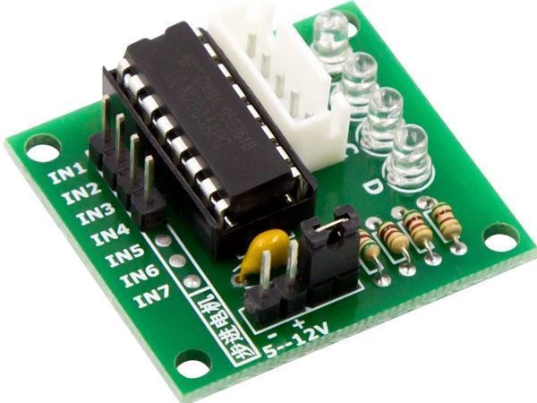
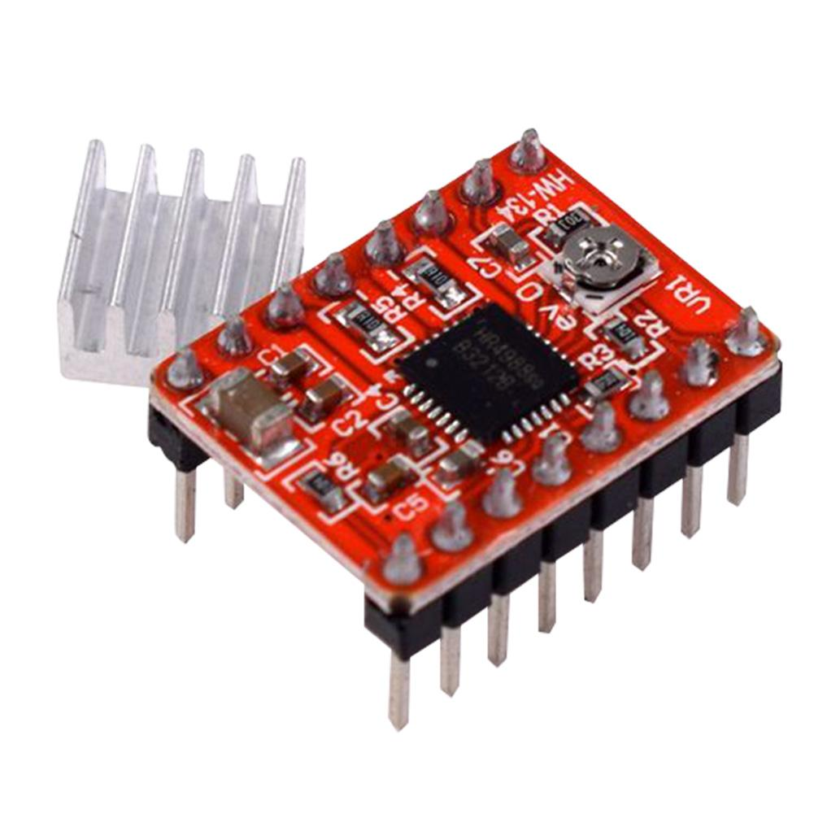

# Daughter board

## Introduction
An explanation of what "daughter board" means.

Daughter boards are printed circuit boards with a required chip mounted on them with few other hardware components. 
## Examples of photos

