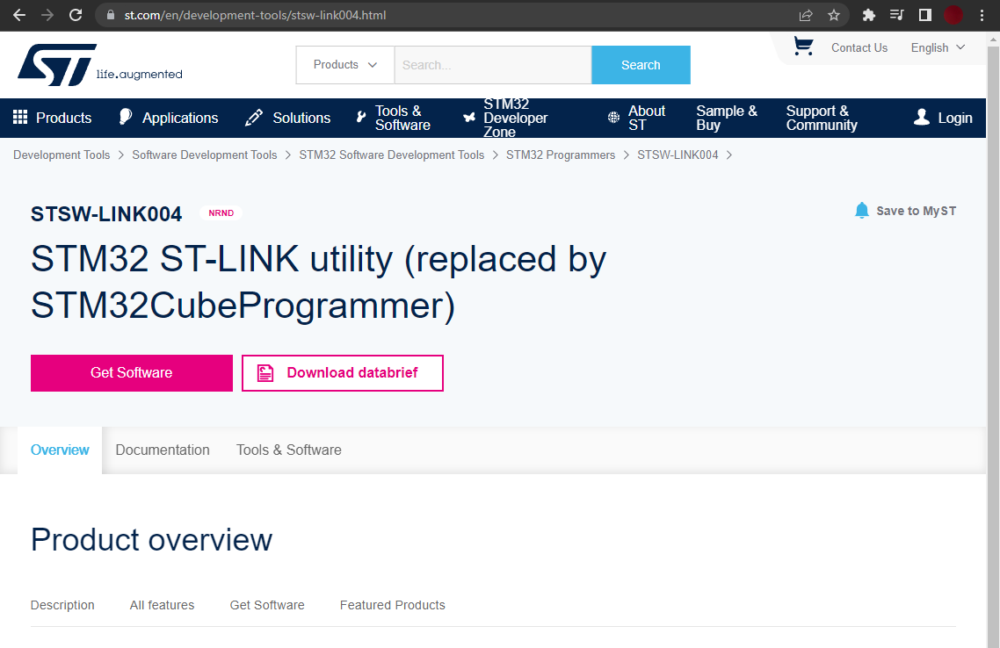
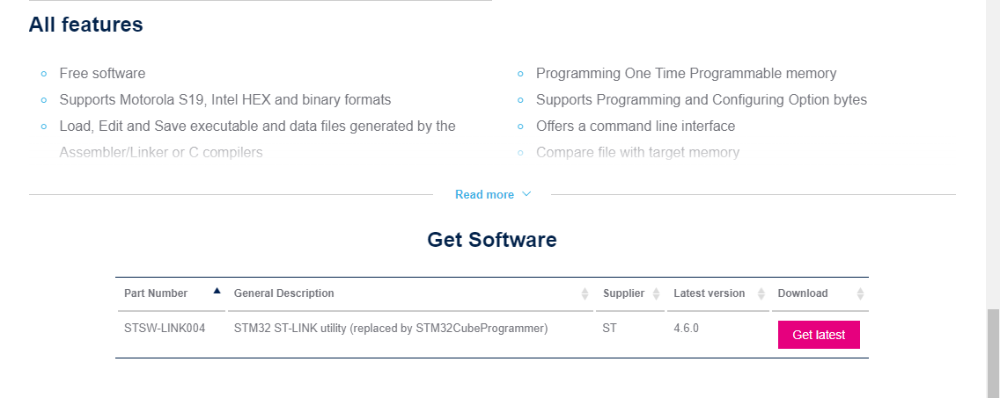
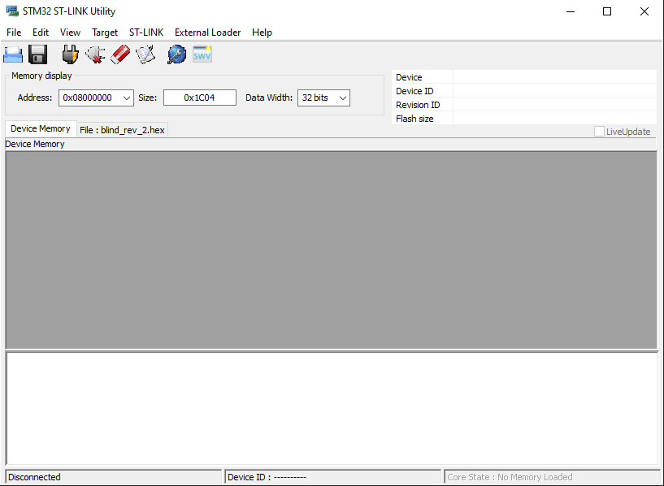
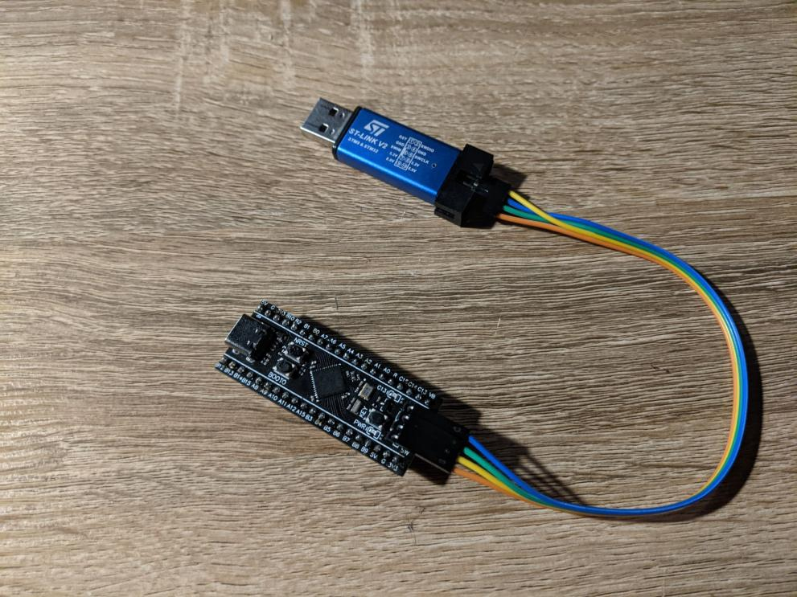
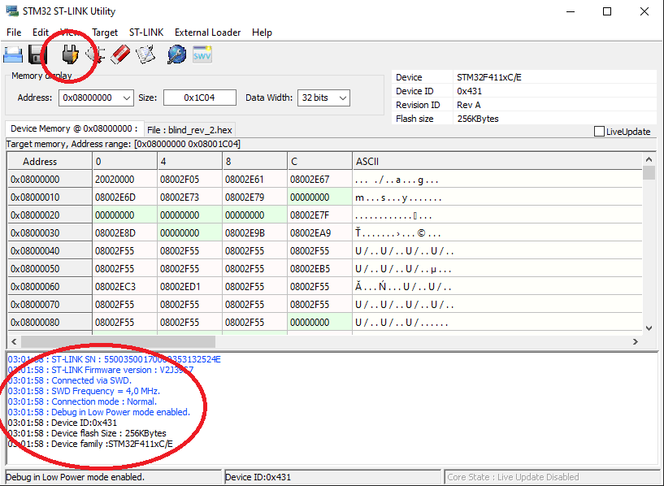
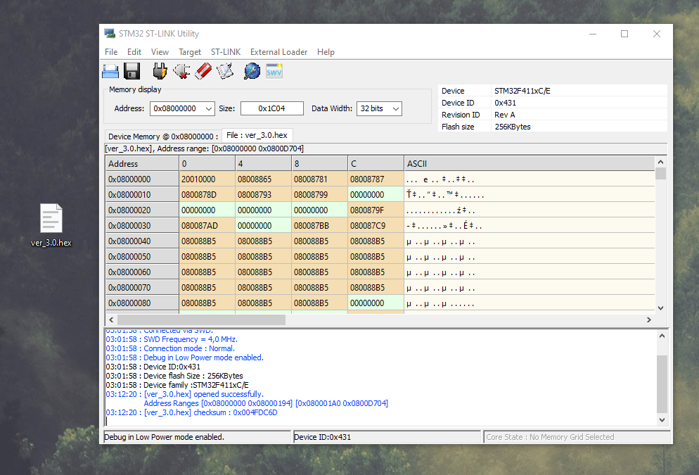
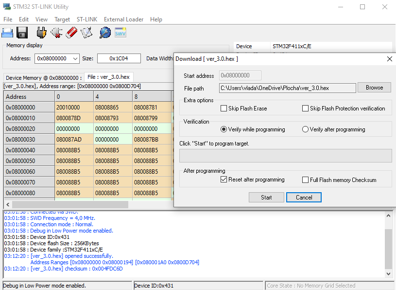
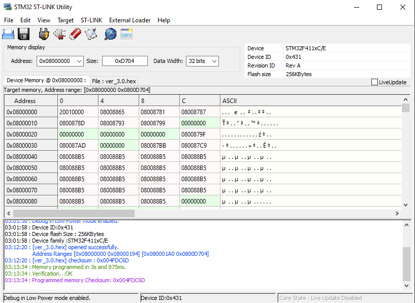
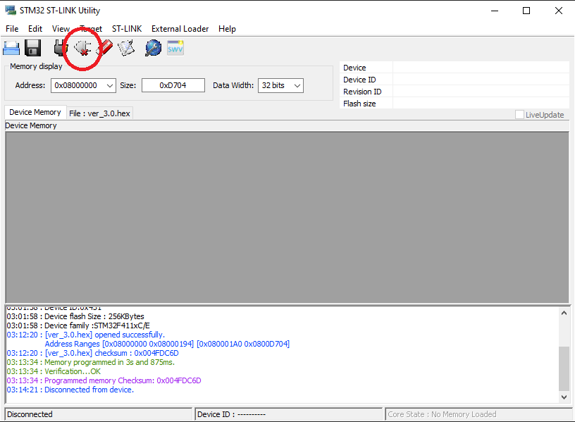

# Uploading

## STM32 ST-LINK utility
### requirements 
- ST Link (if you have [revision 3.0](../Schematic/rev_3.0/)) it already has ST-Link built into it.
- [STM32 ST-LINK utility](https://www.st.com/en/development-tools/stsw-link004.html#get-software)

After downloading the STM32 ST-LINK utility and opening it, you will get [here](../Photo/Photo_used_in_documentation/ST_LINK_utility_3.png).

Now we connect the board to the computer. 
- If we have revision 3.0, it will be much easier, we will only need a mini USB cable.
- If we have revision 1.0, dirstly we will need to connect the board to ST-Link and ST-Link to the computer. [As in the picture](../Photo/Photo_used_in_documentation/ST_LINK_utility_4.jpg)
    - yellow - SWDIO
    - blue - GND
    - green - SWCLK
    - orange -3.3V
- Now we will download the software. In the folder of the software version we want to use, there is a file called ver_x.x.hex, for example (ver_3.0.hex). We'll download it.
- Now we connect the board in the STM32 ST-Link utility, by clicking on the "Connect to the target" button. If the board connects successfully, below we see the name of the board and it is connected. [As in the picture](../Photo/Photo_used_in_documentation/ST_LINK_utility_5.png)
- Now drag the downloaded .hex file into the STM32 ST-Link utility and click on "Program verify" then click on start. Then it should write something similar to the [picture](../Photo/Photo_used_in_documentation/ST_LINK_utility_7.png)
- Now the software is uploaded, all we have to do is disconnect from the device by clicking "Disconnect form the target" [As in the picture](../Photo/Photo_used_in_documentation/ST_LINK_utility_9.png)

### Photo

